# LightDB 4.35.0 — full (20260504-202450)

_Generated from 2 JMH JSON file(s) covering 164 measurements across 11 benchmarks._

**Higher is better** for `thrpt` (ops/s); **lower is better** for `avgt`/`ss` (ms).

## benchmark.jmh.complete.CompleteConcurrency16Benchmark.mixed

_12 runs · unit: ops/s_

| Backend | Score | ± Error | Unit |
|---|---:|---:|---|
| rocksdb+tantivy | 818,916 | 11,709 | ops/s |
| rocksdb+lucene | 786,693 | 32,177 | ops/s |
| rocksdb | 784,579 | 108,696 | ops/s |
| halodb | 770,909 | 51,388 | ops/s |
| halodb+lucene | 731,613 | 14,582 | ops/s |
| halodb+tantivy | 700,123 | 35,032 | ops/s |
| lucene | 224,329 | 16,343 | ops/s |
| h2 | 48,329 | 1,554 | ops/s |
| mapdb | 39,015 | 389.9 | ops/s |
| sqlite | 36,475 | 1,473 | ops/s |
| tantivy | 28,620 | 140.1 | ops/s |
| duckdb | 2,777 | 796.4 | ops/s |

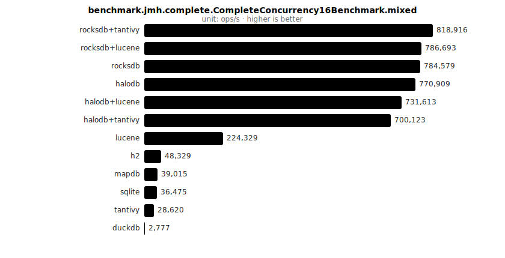

## benchmark.jmh.complete.CompleteConcurrency1Benchmark.mixed

_16 runs · unit: ops/s_

| Backend | Score | ± Error | Unit |
|---|---:|---:|---|
| chroniclemap | 330,313 | 8,653 | ops/s |
| lmdb | 277,806 | 10,448 | ops/s |
| rocksdb | 274,799 | 3,199 | ops/s |
| halodb | 270,711 | 5,258 | ops/s |
| halodb+tantivy | 207,853 | 4,978 | ops/s |
| halodb+lucene | 204,927 | 3,892 | ops/s |
| rocksdb+tantivy | 197,037 | 1,706 | ops/s |
| rocksdb+lucene | 190,921 | 6,160 | ops/s |
| h2 | 70,493 | 7,645 | ops/s |
| sqlite | 54,609 | 896.3 | ops/s |
| lucene | 42,606 | 2,327 | ops/s |
| mapdb | 40,170 | 113.3 | ops/s |
| tantivy | 31,591 | 728.9 | ops/s |
| duckdb | 2,965 | 1,103 | ops/s |
| lmdb+lucene | 2,627 | 187.8 | ops/s |
| lmdb+tantivy | 1,147 | 100.6 | ops/s |

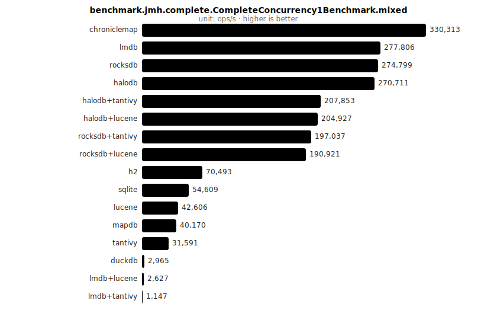

## benchmark.jmh.complete.CompleteConcurrency4Benchmark.mixed

_13 runs · unit: ops/s_

| Backend | Score | ± Error | Unit |
|---|---:|---:|---|
| rocksdb | 759,321 | 29,726 | ops/s |
| halodb | 713,439 | 25,713 | ops/s |
| rocksdb+tantivy | 596,066 | 15,393 | ops/s |
| rocksdb+lucene | 581,629 | 17,844 | ops/s |
| halodb+lucene | 561,634 | 19,648 | ops/s |
| halodb+tantivy | 555,004 | 41,722 | ops/s |
| lucene | 141,483 | 2,250 | ops/s |
| h2 | 56,960 | 2,505 | ops/s |
| mapdb | 44,353 | 397.4 | ops/s |
| sqlite | 43,258 | 1,539 | ops/s |
| tantivy | 37,107 | 5,368 | ops/s |
| duckdb | 2,934 | 908.3 | ops/s |
| lmdb+lucene | 1,260 | 114.0 | ops/s |

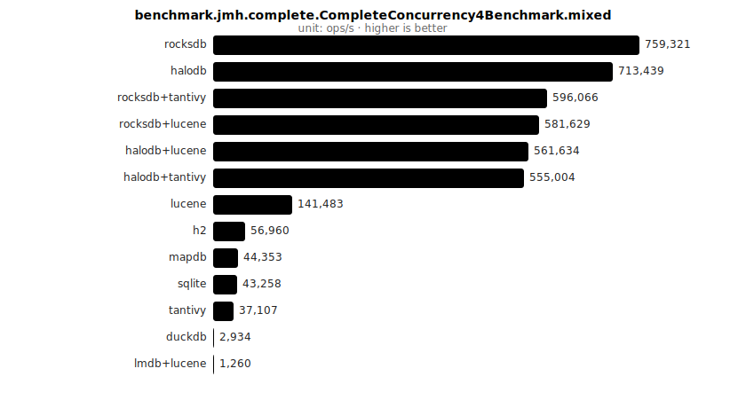

## benchmark.jmh.complete.CompleteQueryBenchmark.filterSortPaginate

_11 runs · unit: ops/s_

| Backend | Score | ± Error | Unit |
|---|---:|---:|---|
| lmdb+lucene | 3,297 | 18.4 | ops/s |
| halodb+lucene | 3,168 | 36.2 | ops/s |
| rocksdb+lucene | 3,027 | 454.5 | ops/s |
| lucene | 1,511 | 348.0 | ops/s |
| halodb+tantivy | 1,338 | 29.2 | ops/s |
| rocksdb+tantivy | 1,303 | 78.4 | ops/s |
| tantivy | 1,283 | 199.1 | ops/s |
| lmdb+tantivy | 1,211 | 11.6 | ops/s |
| duckdb | 312.0 | 6.672 | ops/s |
| sqlite | 177.9 | 1.915 | ops/s |
| h2 | 99.2 | 1.603 | ops/s |

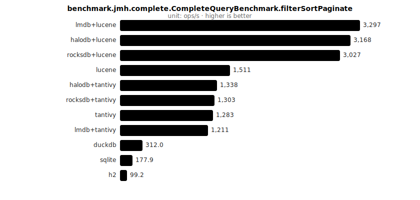

## benchmark.jmh.complete.CompleteQueryBenchmark.fullText

_11 runs · unit: ops/s_

| Backend | Score | ± Error | Unit |
|---|---:|---:|---|
| rocksdb+lucene | 2,620 | 80.0 | ops/s |
| halodb+lucene | 2,603 | 91.5 | ops/s |
| lucene | 2,581 | 17.2 | ops/s |
| lmdb+lucene | 2,520 | 16.5 | ops/s |
| duckdb | 795.2 | 6.727 | ops/s |
| sqlite | 236.9 | 14.7 | ops/s |
| h2 | 79.7 | 3.802 | ops/s |
| tantivy | 40.6 | 0.156 | ops/s |
| rocksdb+tantivy | 40.6 | 0.661 | ops/s |
| halodb+tantivy | 40.2 | 0.181 | ops/s |
| lmdb+tantivy | 39.1 | 1.248 | ops/s |

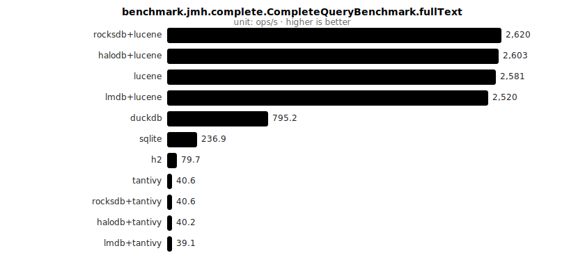

## benchmark.jmh.complete.CompleteQueryBenchmark.rangeFilter

_11 runs · unit: ops/s_

| Backend | Score | ± Error | Unit |
|---|---:|---:|---|
| rocksdb+lucene | 9,711 | 159.4 | ops/s |
| halodb+lucene | 9,558 | 113.4 | ops/s |
| lmdb+lucene | 9,207 | 53.6 | ops/s |
| lucene | 6,871 | 52.5 | ops/s |
| halodb+tantivy | 6,697 | 145.1 | ops/s |
| rocksdb+tantivy | 6,613 | 249.5 | ops/s |
| tantivy | 6,501 | 176.8 | ops/s |
| lmdb+tantivy | 6,247 | 67.3 | ops/s |
| sqlite | 4,369 | 134.7 | ops/s |
| duckdb | 1,976 | 7.406 | ops/s |
| h2 | 244.0 | 6.680 | ops/s |

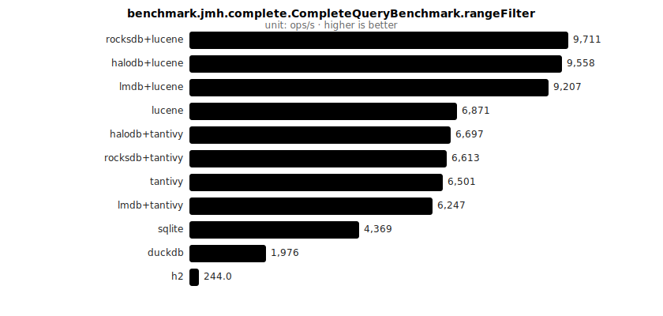

## benchmark.jmh.complete.CompleteQueryBenchmark.termFilter

_11 runs · unit: ops/s_

| Backend | Score | ± Error | Unit |
|---|---:|---:|---|
| rocksdb+lucene | 100,795 | 3,580 | ops/s |
| lmdb+lucene | 98,626 | 2,311 | ops/s |
| lucene | 93,578 | 5,310 | ops/s |
| h2 | 92,020 | 4,410 | ops/s |
| halodb+lucene | 82,947 | 20,958 | ops/s |
| sqlite | 39,454 | 6,385 | ops/s |
| rocksdb+tantivy | 27,892 | 483.1 | ops/s |
| halodb+tantivy | 25,329 | 2,108 | ops/s |
| tantivy | 24,325 | 2,854 | ops/s |
| lmdb+tantivy | 21,106 | 191.5 | ops/s |
| duckdb | 2,435 | 486.8 | ops/s |

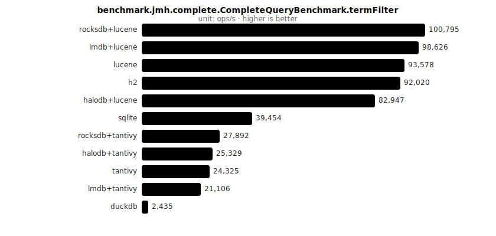

## benchmark.jmh.complete.CompleteReadBenchmark.fullScan

_16 runs · unit: ms/op_

| Backend | Score | ± Error | Unit |
|---|---:|---:|---|
| duckdb | 835.0 | 36.6 | ms/op |
| sqlite | 789.5 | 4.053 | ms/op |
| h2 | 714.3 | 6.430 | ms/op |
| halodb+lucene | 173.0 | 35.8 | ms/op |
| halodb | 166.7 | 50.3 | ms/op |
| halodb+tantivy | 164.0 | 6.727 | ms/op |
| chroniclemap | 121.2 | 0.588 | ms/op |
| rocksdb+lucene | 86.7 | 15.2 | ms/op |
| mapdb | 86.7 | 1.893 | ms/op |
| lmdb | 86.1 | 8.444 | ms/op |
| rocksdb | 84.1 | 17.0 | ms/op |
| lmdb+lucene | 81.4 | 5.869 | ms/op |
| rocksdb+tantivy | 77.9 | 1.381 | ms/op |
| lmdb+tantivy | 77.0 | 1.830 | ms/op |
| lucene | 21.8 | 1.152 | ms/op |
| tantivy | 8.456 | 5.584 | ms/op |

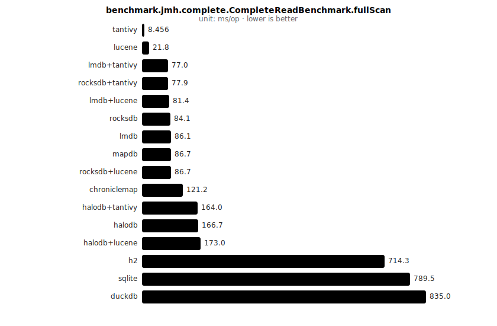

## benchmark.jmh.complete.CompleteReadBenchmark.get

_16 runs · unit: ops/s_

| Backend | Score | ± Error | Unit |
|---|---:|---:|---|
| chroniclemap | 431,732 | 3,519 | ops/s |
| rocksdb+tantivy | 403,580 | 5,612 | ops/s |
| rocksdb | 392,312 | 3,200 | ops/s |
| lmdb+tantivy | 388,371 | 9,669 | ops/s |
| rocksdb+lucene | 385,195 | 15,280 | ops/s |
| lmdb+lucene | 380,764 | 8,370 | ops/s |
| lmdb | 376,591 | 10,674 | ops/s |
| halodb+tantivy | 358,705 | 6,023 | ops/s |
| halodb | 352,562 | 4,773 | ops/s |
| halodb+lucene | 348,636 | 7,143 | ops/s |
| h2 | 78,082 | 996.9 | ops/s |
| mapdb | 61,084 | 521.2 | ops/s |
| sqlite | 58,478 | 453.6 | ops/s |
| lucene | 36,177 | 1,651 | ops/s |
| tantivy | 28,541 | 235.9 | ops/s |
| duckdb | 6,288 | 22.7 | ops/s |

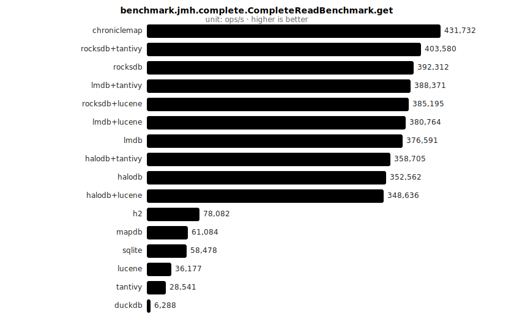

## benchmark.jmh.complete.CompleteWriteBenchmark.bulkInsert

_32 runs · unit: ms/op_

| Backend | Score | ± Error | Unit |
|---|---:|---:|---|
| duckdb [ batch=buffered] | 110,831 | 1,447 | ms/op |
| duckdb [ batch=async] | 106,634 | 1,104 | ms/op |
| mapdb [ batch=buffered] | 2,217 | 10.6 | ms/op |
| halodb+lucene [ batch=async] | 2,008 | 239.1 | ms/op |
| rocksdb+lucene [ batch=async] | 1,983 | 386.9 | ms/op |
| h2 [ batch=async] | 1,960 | 76.9 | ms/op |
| sqlite [ batch=async] | 1,903 | 196.6 | ms/op |
| lmdb+lucene [ batch=async] | 1,859 | 280.5 | ms/op |
| sqlite [ batch=buffered] | 1,816 | 68.5 | ms/op |
| h2 [ batch=buffered] | 1,811 | 145.4 | ms/op |
| mapdb [ batch=async] | 1,794 | 119.1 | ms/op |
| rocksdb+tantivy [ batch=async] | 1,753 | 298.9 | ms/op |
| halodb+tantivy [ batch=async] | 1,748 | 348.8 | ms/op |
| lmdb+tantivy [ batch=async] | 1,668 | 676.2 | ms/op |
| halodb+lucene [ batch=buffered] | 1,475 | 179.7 | ms/op |
| lmdb+lucene [ batch=buffered] | 1,414 | 235.7 | ms/op |
| rocksdb+lucene [ batch=buffered] | 1,328 | 86.0 | ms/op |
| halodb+tantivy [ batch=buffered] | 1,308 | 97.0 | ms/op |
| lmdb+tantivy [ batch=buffered] | 1,285 | 183.0 | ms/op |
| lucene [ batch=async] | 1,181 | 218.0 | ms/op |
| rocksdb+tantivy [ batch=buffered] | 1,093 | 85.5 | ms/op |
| chroniclemap [ batch=async] | 968.1 | 165.4 | ms/op |
| tantivy [ batch=async] | 847.6 | 127.2 | ms/op |
| lucene [ batch=buffered] | 834.0 | 62.2 | ms/op |
| halodb [ batch=async] | 717.0 | 157.3 | ms/op |
| lmdb [ batch=async] | 692.8 | 146.1 | ms/op |
| tantivy [ batch=buffered] | 667.7 | 86.2 | ms/op |
| rocksdb [ batch=async] | 603.7 | 21.4 | ms/op |
| halodb [ batch=buffered] | 599.1 | 21.9 | ms/op |
| chroniclemap [ batch=buffered] | 572.8 | 11.1 | ms/op |
| lmdb [ batch=buffered] | 468.6 | 90.3 | ms/op |
| rocksdb [ batch=buffered] | 352.0 | 17.1 | ms/op |

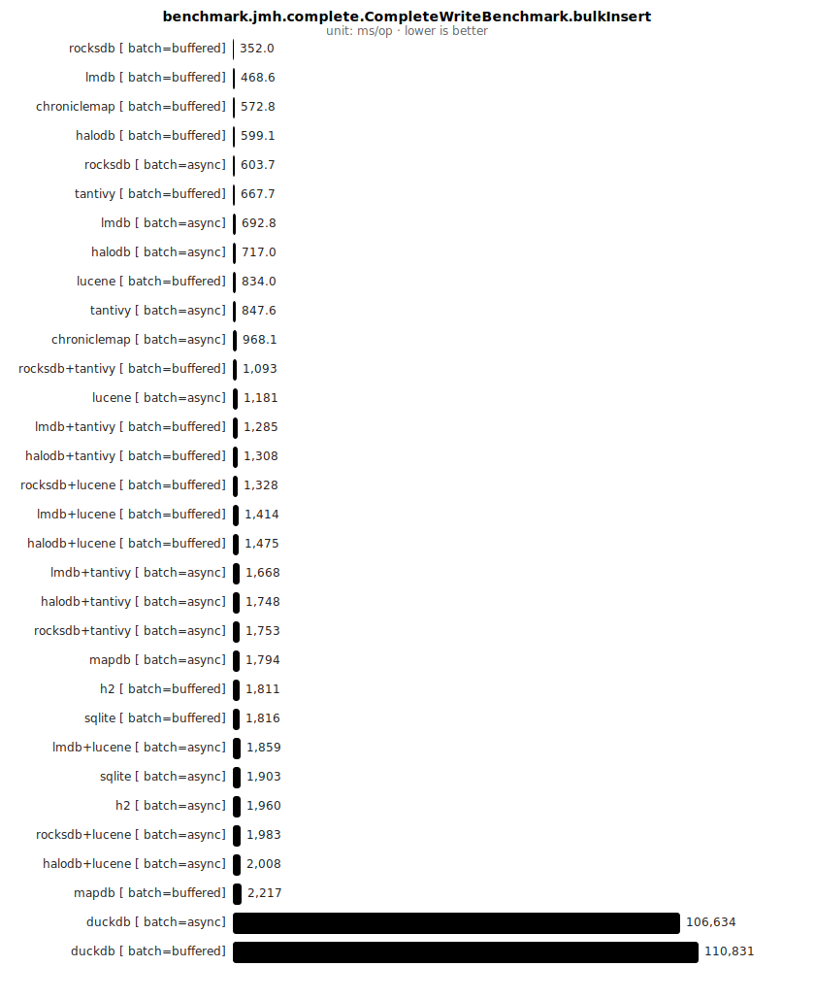

## benchmark.jmh.complete.CompleteWriteBenchmark.upsert

_15 runs · unit: ops/s_

| Backend | Score | ± Error | Unit |
|---|---:|---:|---|
| rocksdb | 209,476 | 2,583 | ops/s |
| tantivy | 191,813 | 5,312 | ops/s |
| lucene | 180,584 | 2,789 | ops/s |
| lmdb | 167,107 | 5,315 | ops/s |
| halodb | 148,303 | 5,814 | ops/s |
| rocksdb+tantivy | 91,620 | 1,014 | ops/s |
| rocksdb+lucene | 90,574 | 747.3 | ops/s |
| halodb+tantivy | 85,623 | 4,659 | ops/s |
| halodb+lucene | 83,958 | 717.0 | ops/s |
| h2 | 69,445 | 7,524 | ops/s |
| sqlite | 51,708 | 4,796 | ops/s |
| mapdb | 20,280 | 206.9 | ops/s |
| duckdb | 802.8 | 50.2 | ops/s |
| lmdb+lucene | 389.5 | 231.1 | ops/s |
| lmdb+tantivy | 249.0 | 16.2 | ops/s |

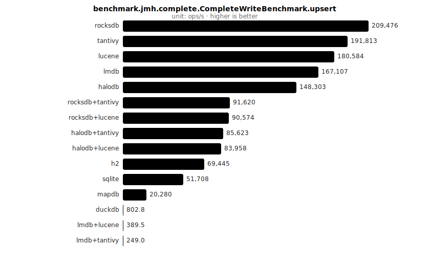

